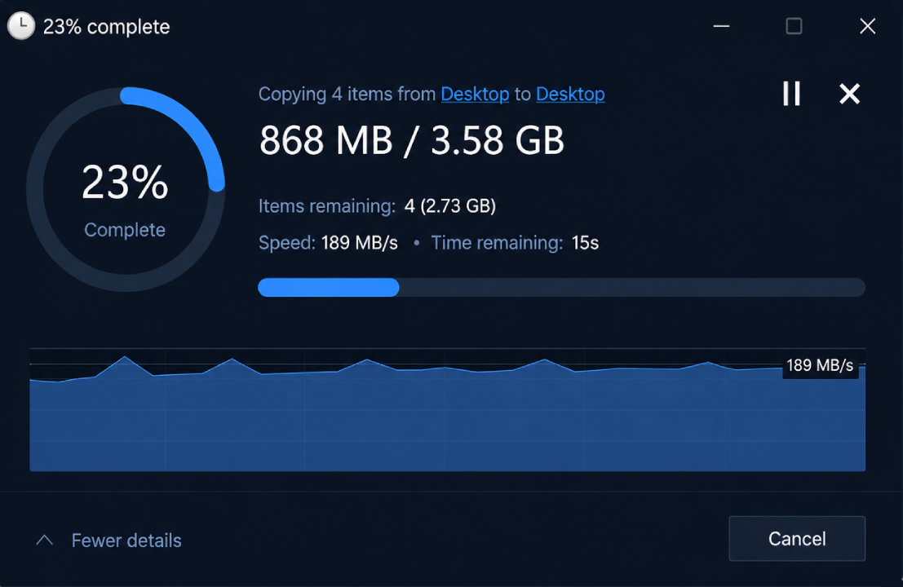
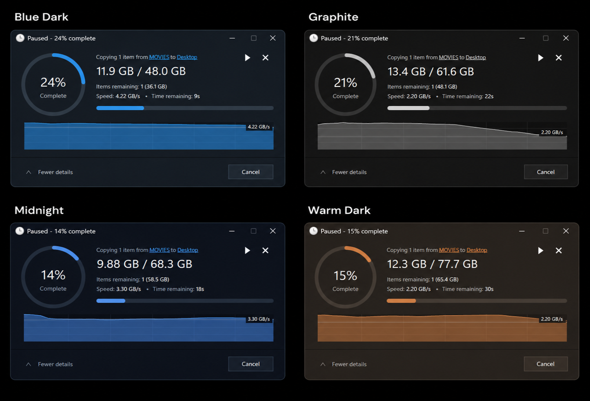

# File Operation Styler

A modern replacement for the standard Windows 11 file operation window.

File Operation Styler gives copy, move, delete, and recycle operations a cleaner modern layout while keeping the normal Windows file operation behavior.

## Features

- Modern copy and move progress window
- Circular percentage indicator
- Transferred size, remaining items, speed, and estimated time
- Progress graph in More Details view
- Multiple file operations in the same window
- Pause, resume, and cancel controls
- Works with normal Windows conflict and error dialogs
- Several built-in themes
- Custom colors, fonts, text sizes, and progress thickness

## Customization

Choose one of the included themes or adjust a few basic options to create your own look.

## Screenshots

## Notes

File Operation Styler changes the appearance of the normal file operation window only.  
Windows continues to handle the actual copy, move, delete, conflicts, and errors.