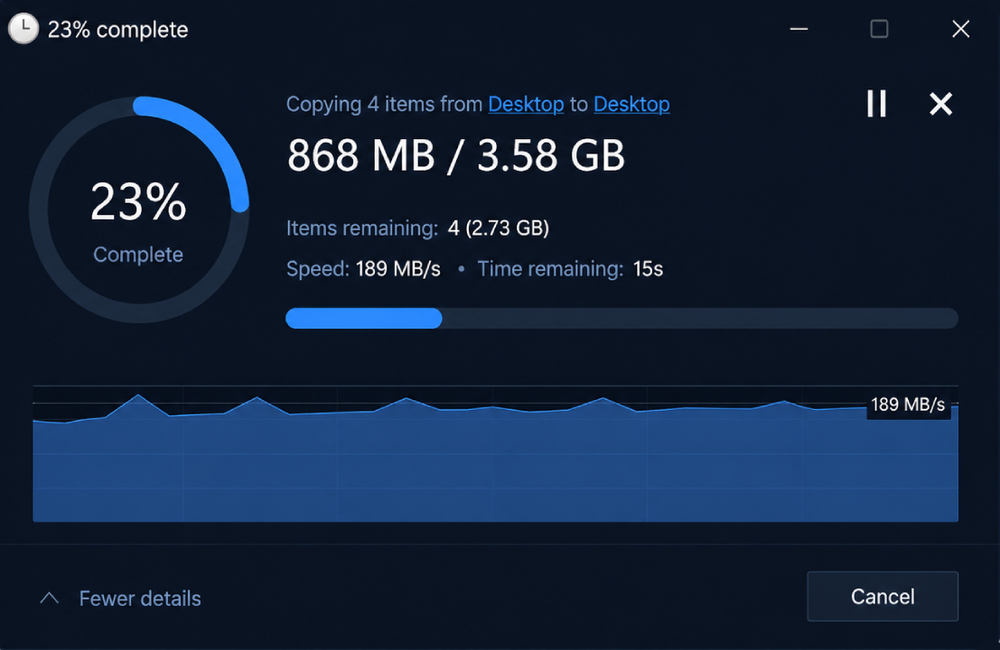
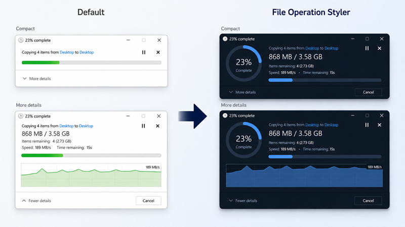
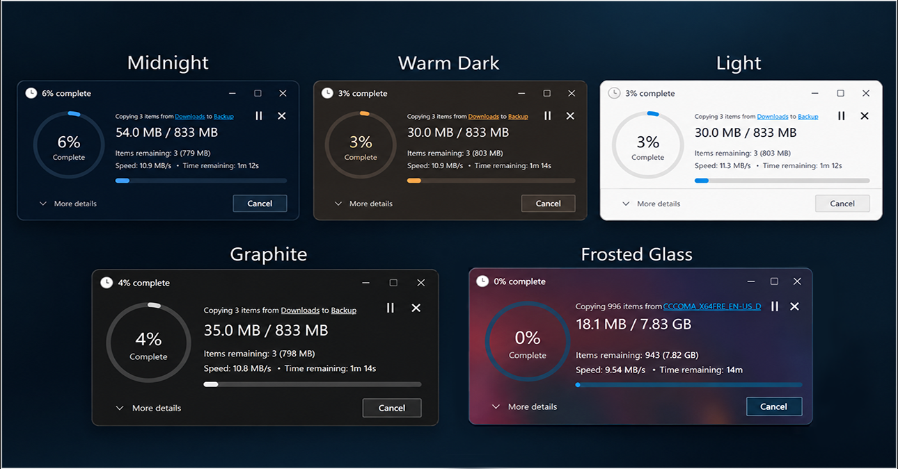

# File Operation Styler

A modern replacement for the standard Windows 11 file operation window.

File Operation Styler gives copy, move, delete, and recycle operations a cleaner modern layout while keeping the normal Windows file operation behavior.

## Screenshots

### Default vs File Operation Styler

### Themes

## What's new in 1.2.0

- Added a Frosted Glass theme with Windows Acrylic and Custom Blur styles.
- Added current-file progress while the circular indicator continues to show overall operation progress.
- Added interactive Pause / Resume behavior to the large progress circle.
- Added an option to hide the small Pause / Resume and Cancel buttons in the upper-right corner. The large progress-circle control and bottom Cancel button remain available.
- Added an option to hide the percentage from the file-operation window title.\*
- Improved multiple-operation support, including synchronized More / Fewer Details behavior.
- Improved fallback to the native Windows UI for conflicts, errors, and unsupported presentation states.
- Improved restoration and teardown when the mod is disabled, reloaded, or settings are changed.

### About hiding the title percentage

\* **Hide title-bar percentage** removes the normal progress percentage from the file-operation window title.

Windows also reuses this window-title text in places such as taskbar previews, Alt+Tab, and other shell UI. Because of this, enabling the option can also remove the percentage from those locations.

There is currently no reliable way for File Operation Styler to hide only the percentage in the window title without also affecting those Windows surfaces.

## Features

- Modern copy, move, delete, and recycle operation window
- Circular overall progress indicator
- Current-file progress bar
- Transferred size, remaining items, speed, and estimated time
- Progress graph in More Details view
- Multiple file operations in the same window
- Pause, resume, and cancel controls
- Interactive Pause / Resume control in the large progress circle
- Option to hide the small Pause / Resume and Cancel buttons
- Option to hide the percentage from the window title
- Works with normal Windows conflict and error dialogs
- Several built-in themes, including Frosted Glass
- Windows Acrylic and Custom Blur glass styles
- Custom colors, fonts, text sizes, and progress thickness

## Customization

Choose one of the included themes or adjust the available colors, typography, progress styling, and other presentation options to create your own look.

The Frosted Glass theme supports both Windows Acrylic and Custom Blur, including adjustable tint and opacity.

## Notes

File Operation Styler changes the appearance of the normal Windows file operation window only. Windows continues to handle the actual copy, move, delete, conflicts, errors, pause, resume, and cancel operations.

Settings changes apply to new file-operation windows; operations already in progress may use the native Windows presentation until they complete.

File Operation Styler has been tested on Windows 11 24H2 x64. It relies on private Explorer and Shell presentation interfaces, so other Windows builds can use different symbols or layouts. Unsupported presentations are designed to fall back to the native Windows UI.
